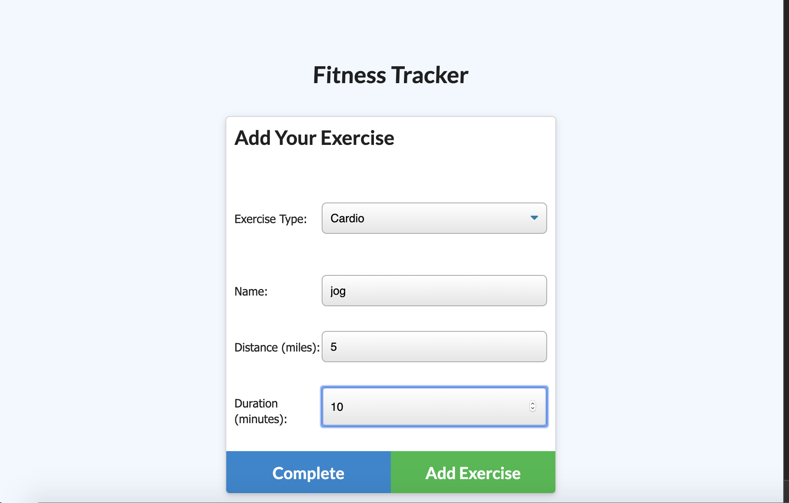

## Fitness Tracker 
<!-- <a href="https://tracksnax.herokuapp.com/">Try It Out</a> -->

## Description

FITNESS TRACKER- Track your workouts.  Create a new workout, or continue a previous workout.

## Table of Contents

* [Installation](#Installation) 

* [Technologies](#Technologies) 

* [Questions](#Questions)

## Installation

To install necessary dependencies, run the following command.

    npm install

## Technologies

    HTML/CSS/BOOTSTRAP/JAVASCRIPT/NODE/EXPRESS/MONGODB

    
 

## Questions

 <a href="https://vartanyane.github.io/portfolioFinal/">If you have any questions please contact me</a>